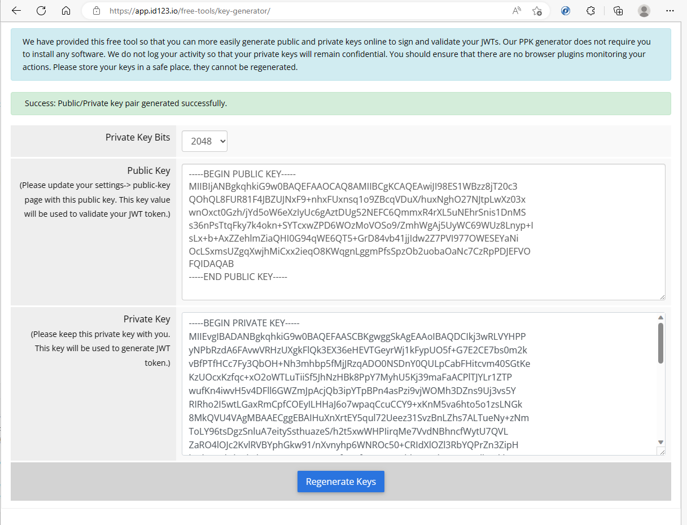
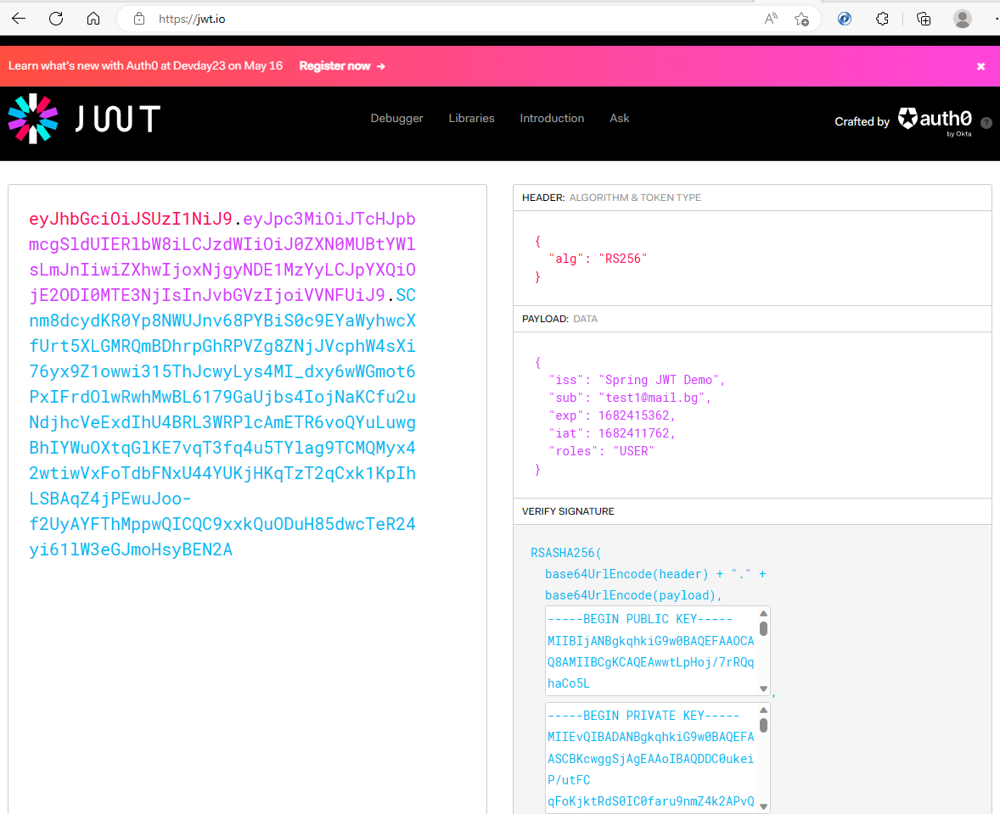

# Spring Boot JWT Demo

- Swagger URL: http://localhost:9090/swagger-ui/index.html

## 1. Tech Stack:

- Java 17
- Spring Boot 2.7.11
  - spring-boot-starter-web (to enable REST)
  - spring-boot-starter-security (to enable Spring Security)
  - spring-boot-starter-oauth2-resource-server (provides support for OAuth 2.0 Bearer Tokens) - https://docs.spring.io/spring-security/reference/servlet/oauth2/resource-server/index.html
  - spring-security-oauth2-jose (provides support for decoding and verifying JWTs)
  - spring-boot-starter-data-jpa (to manage DB objects)
- org.bouncycastle:bcprov-jdk15on (lightweight Java cryptography API) - https://www.bouncycastle.org/java.html
- org.springdoc:springdoc-openapi-ui (Spring Boot support for OpenAPI 3 & Swagger UI) - https://springdoc.org/
- Oracle 21 XE DB - Oracle Express Edition
- Lombok (to remove boilerplate code like accessors/ constructors/ etc) - https://projectlombok.org/
- Apache commons-lang3 (provides popular utility methods) - https://commons.apache.org/proper/commons-lang/
- Maven 3.8 (Build Tool)

## 2. Configure the DEMO (*do it only once*)

### Checkout current project

``` 
git clone https://github.com/stuckata/spring-boot-security-jwt-demo.git 
```

### Create & Start the DB container (using docker-compose)

Use this command only the first time to create & start the DB container.
``` 
docker-compose up -d 
```

### Connect to the DB (using some DB tool like DBeaver or DataGrip)

```properties
url=jdbc:oracle:thin:@localhost:1521:XE
user=system
pwd=oracle
```

DataGrip Example:


### Init DB (execute initial scripts)

Run the SQL scripts, located under ```/src/main/resources/db/oracle``` in the order they appear.

1). Init
db - [V0.0.1.20230424.1809.00359__init_db.sql](src%2Fmain%2Fresources%2Fdb%2Foracle%2FV0.0.1.20230424.1809.00359__init_db.sql)

2). Create
tables - [V0.0.1.20230424.1809.26326__create_table_users.sql](src%2Fmain%2Fresources%2Fdb%2Foracle%2FV0.0.1.20230424.1809.26326__create_table_users.sql)

### Stop Services (DB)
``` 
docker-compose stop
```

### Change application.properties (if needed)

You can see different settings there, that can be modified.
[application.properties](src%2Fmain%2Fresources%2Fapplication.properties)

### Change application-dev.properties (if needed)

You can see different settings there, that can be modified.
[application-dev.properties](src%2Fmain%2Fresources%2Fapplication-dev.properties)

### Select "dev" Spring profile to run the example

IntelliJ IDEA:


### Generate *YOUR OWN* Public-Private Key Pair

1). You can use some free online tool like this one:
https://app.id123.io/free-tools/key-generator/



2). Copy & Paste generated values to: ```/src/main/resources/keys```

- Public Key: [app.pub](src%2Fmain%2Fresources%2Fkeys%2Fapp.pub)
- Private Key: [app.key](src%2Fmain%2Fresources%2Fkeys%2Fapp.key)

## 3. Start the DEMO

### Start Services (DB)
``` 
docker-compose start
```
### Run the Demo App (with your IDE)
Use your favorite IDE to run the app as Spring Application.

### Open Swagger UI
Swagger UI allows you to access all exposed REST endpoints.

> http://localhost:9090/swagger-ui/index.html

### Use Postman Collection
```postman-collection/spring-jwt-demo.postman_collection.json```

## Useful Commands & Links

### Decode JWT

Go to https://jwt.io/



### Kill process, listening on specific port

```
> netstat -ano | findstr :1521

> taskkill /PID <PID> /F
```