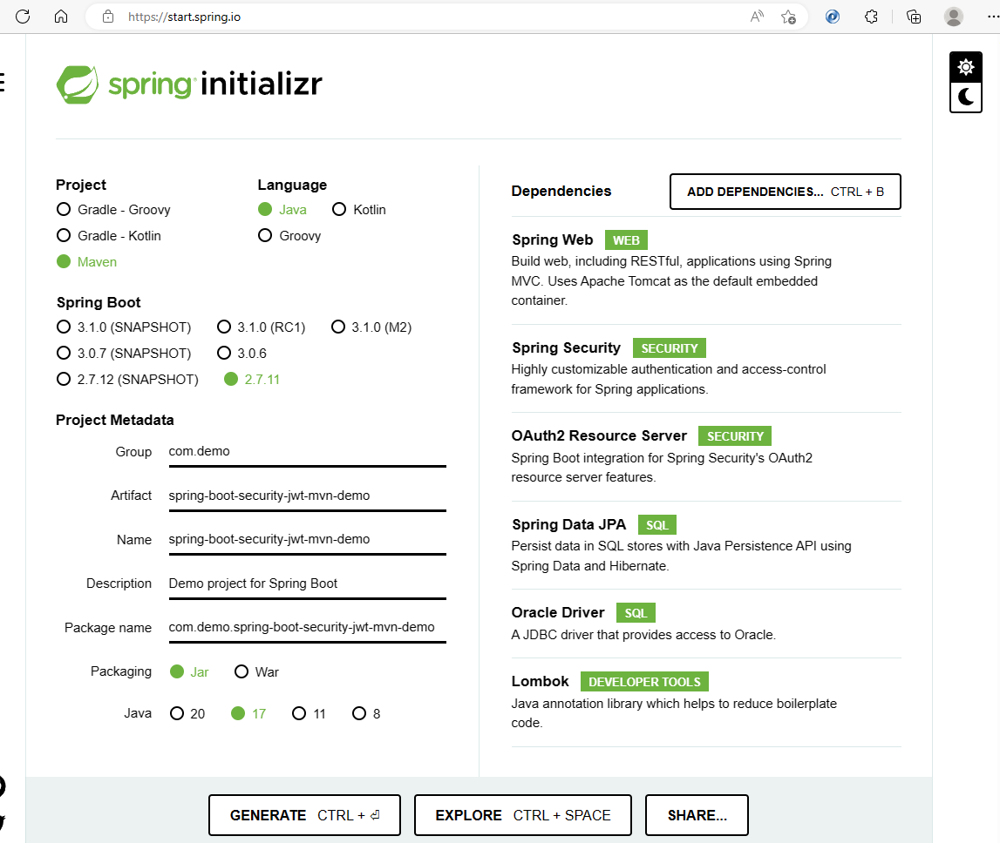
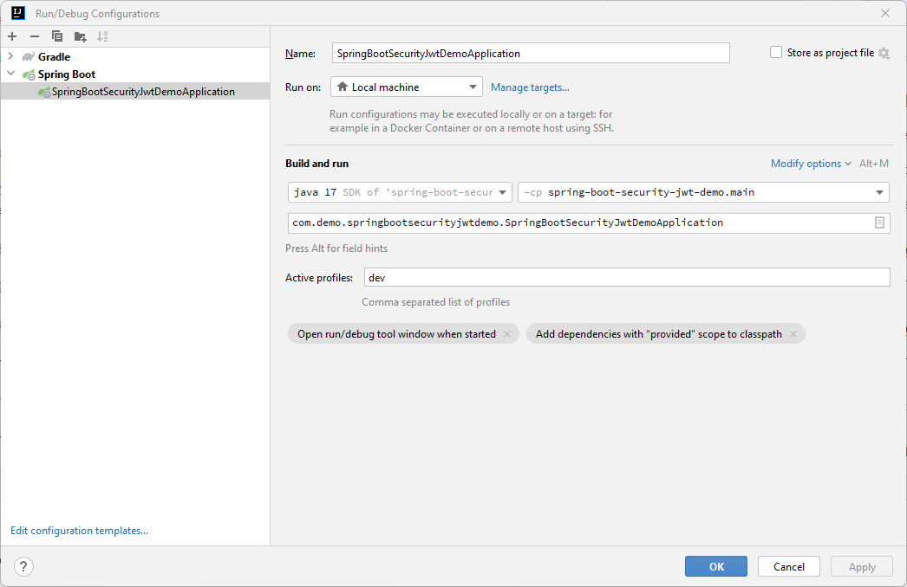

# Spring Boot JWT Demo

- Swagger URL: http://localhost:9090/swagger-ui/index.html

## Create NEW Project

Use this steps to create a new project.

### Generate Spring Boot project

1). Go to ["Spring Initializr"](https://start.spring.io/)

2). Select whatever you need

3). Add the dependencies you need

4). Generate Project


5). Unzip and open with some IDE

### Add project to GIT

```
echo "# spring-boot-security-jwt-demo" >> README.md
git init
git add README.md
git commit -m "first commit"
git branch -M main
git remote add origin https://github.com/stuckata/spring-boot-security-jwt-demo.git
git push -u origin main
```


## Run current project

### Checkout current project
> git clone https://github.com/stuckata/spring-boot-security-jwt-demo.git

### Run DB (using docker-compose)
> docker compose up -d

### Connect to the DB (using some DB tool like DBeaver or DataGrip)
```properties
url=jdbc:oracle:thin:@localhost:1521:XE
user=system
pwd=oracle
```
DataGrip Example:


### Init DB (execute initial scripts)
Run the SQL scripts, located under ```/src/main/resources/db/oracle``` in the order they appear.

1). Init db - [V0.0.1.20230424.1809.00359__init_db.sql](src%2Fmain%2Fresources%2Fdb%2Foracle%2FV0.0.1.20230424.1809.00359__init_db.sql)

2). Create tables - [V0.0.1.20230424.1809.26326__create_table_users.sql](src%2Fmain%2Fresources%2Fdb%2Foracle%2FV0.0.1.20230424.1809.26326__create_table_users.sql)

### Change application.properties (if needed)

You can see different settings there, that can be modified.

### Change application-dev.properties (if needed) 

You can see different settings there, that can be modified.

### Select "dev" Spring profile to run the example

IntelliJ IDEA:


### Generate *YOUR OWN* Public-Private Key Pair
1). You can use some free online tool like this one:
https://app.id123.io/free-tools/key-generator/


2). Copy & Paste generated values to: ```/src/main/resources/keys```

### Run the Demo (with you IDE)

### Open Swagger UI
 > http://localhost:9090/swagger-ui/index.html


## Implementation Explained


## Other commands, that might be needed
### Kill process, listening on specific port
> netstat -ano | findstr :1521
> taskkill /PID <PID> /F